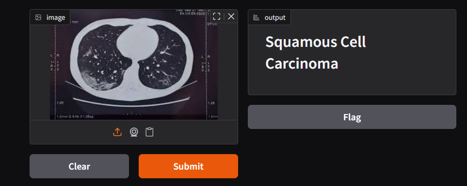

### Project Overview

LungAI is a deep learning project aimed at detecting and classifying lung cancer from CT scan images. This model uses a **ResNet50** architecture with transfer learning to differentiate between cancerous and non-cancerous lung tissue, as well as classify specific types of lung cancer.

### Model Performance

This model was trained for 50 epochs on the dorsar/lung-cancer dataset, achieving the following performance on the test set:

*   **Final Test Accuracy: 83.73%**
    
*   **Best Validation Accuracy: 81.94%**
    

### Repository Structure

*   Architecture/: Contains the core model script.
    
    *   architecture.py: Defines, trains, and evaluates the ResNet50 model.
        
*   Processed\_Data/: (Not in repository) Directory created by the preprocessor.
    
*   app.py: Runs the Gradio web demo.
    
*   preprocess.py: Downloads and organizes data from Hugging Face.
    
*   requirements.txt: List of Python dependencies.
    
*   lung\_cancer\_detection\_model.pth: (Generated) PyTorch weights.
    
*   lung\_cancer\_detection\_model.onnx: (Generated) ONNX model for deployment.
    

### Data

The dataset is sourced from Hugging Face and is downloaded by the preprocess.py script:[https://huggingface.co/datasets/dorsar/lung-cancer](https://huggingface.co/datasets/dorsar/lung-cancer)

### Setup and Usage

**Step 1: Install Dependencies**First, ensure you have Python installed. Then, install the required Python libraries using the following command:

Bash

Plain textANTLR4BashCC#CSSCoffeeScriptCMakeDartDjangoDockerEJSErlangGitGoGraphQLGroovyHTMLJavaJavaScriptJSONJSXKotlinLaTeXLessLuaMakefileMarkdownMATLABMarkupObjective-CPerlPHPPowerShell.propertiesProtocol BuffersPythonRRubySass (Sass)Sass (Scss)SchemeSQLShellSwiftSVGTSXTypeScriptWebAssemblyYAMLXML`   pip install -r requirements.txt   `

**Step 2: Log in to Hugging Face**To avoid rate-limiting errors when downloading the dataset, log in using the Hugging Face CLI:

Bash

Plain textANTLR4BashCC#CSSCoffeeScriptCMakeDartDjangoDockerEJSErlangGitGoGraphQLGroovyHTMLJavaJavaScriptJSONJSXKotlinLaTeXLessLuaMakefileMarkdownMATLABMarkupObjective-CPerlPHPPowerShell.propertiesProtocol BuffersPythonRRubySass (Sass)Sass (Scss)SchemeSQLShellSwiftSVGTSXTypeScriptWebAssemblyYAMLXML`   huggingface-cli login   `

**Step 3: Download and Preprocess Data**Run the preprocessing script. This will download the dataset, map the classes, and save them in the correct Processed\_Data directory.

Bash

Plain textANTLR4BashCC#CSSCoffeeScriptCMakeDartDjangoDockerEJSErlangGitGoGraphQLGroovyHTMLJavaJavaScriptJSONJSXKotlinLaTeXLessLuaMakefileMarkdownMATLABMarkupObjective-CPerlPHPPowerShell.propertiesProtocol BuffersPythonRRubySass (Sass)Sass (Scss)SchemeSQLShellSwiftSVGTSXTypeScriptWebAssemblyYAMLXML`   python preprocess.py   `

**Step 4: Train the Model**Run the training script. This will train the model using your GPU, print the progress, and save the final .pth and .onnx model files.

Bash

Plain textANTLR4BashCC#CSSCoffeeScriptCMakeDartDjangoDockerEJSErlangGitGoGraphQLGroovyHTMLJavaJavaScriptJSONJSXKotlinLaTeXLessLuaMakefileMarkdownMATLABMarkupObjective-CPerlPHPPowerShell.propertiesProtocol BuffersPythonRRubySass (Sass)Sass (Scss)SchemeSQLShellSwiftSVGTSXTypeScriptWebAssemblyYAMLXML`   python Architecture/architecture.py   `

**Step 5: Run the Model (Demo)**Run the Gradio application to see your trained model in action.

Bash

Plain textANTLR4BashCC#CSSCoffeeScriptCMakeDartDjangoDockerEJSErlangGitGoGraphQLGroovyHTMLJavaJavaScriptJSONJSXKotlinLaTeXLessLuaMakefileMarkdownMATLABMarkupObjective-CPerlPHPPowerShell.propertiesProtocol BuffersPythonRRubySass (Sass)Sass (Scss)SchemeSQLShellSwiftSVGTSXTypeScriptWebAssemblyYAMLXML`   python app.py   `

This will provide a local URL to open in your browser.

### Notes

*   The preprocess.py script automatically creates the Processed\_Data directory with train, validation, and test subdirectories.
    
*   The architecture.py script is set up to find these specific folders.
    
### Demo
        

### Contributing

If you would like to contribute to this project, please fork the repository and submit a pull request. We welcome improvements, bug fixes, and new features.